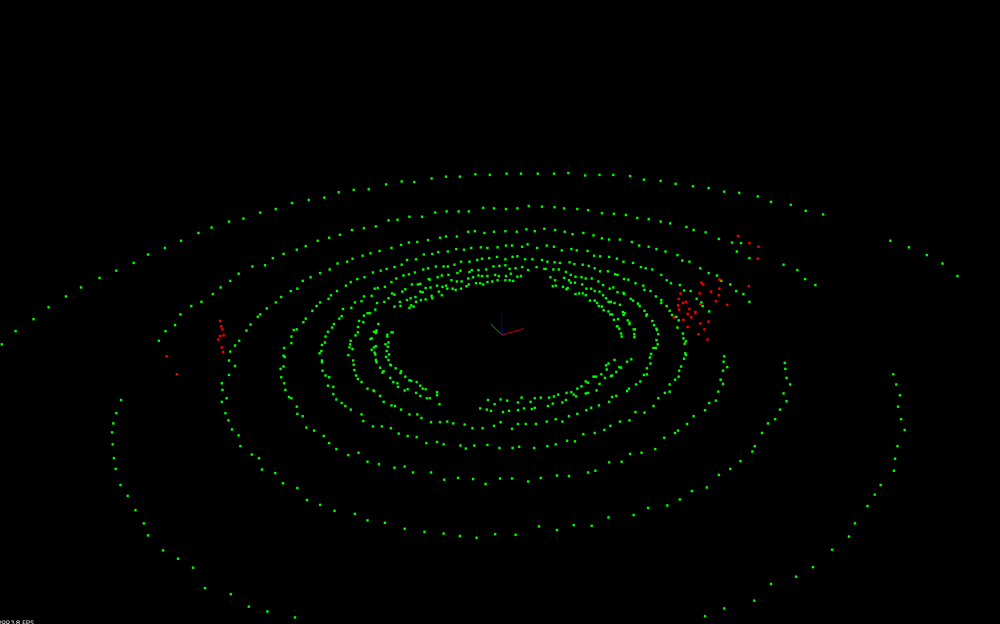
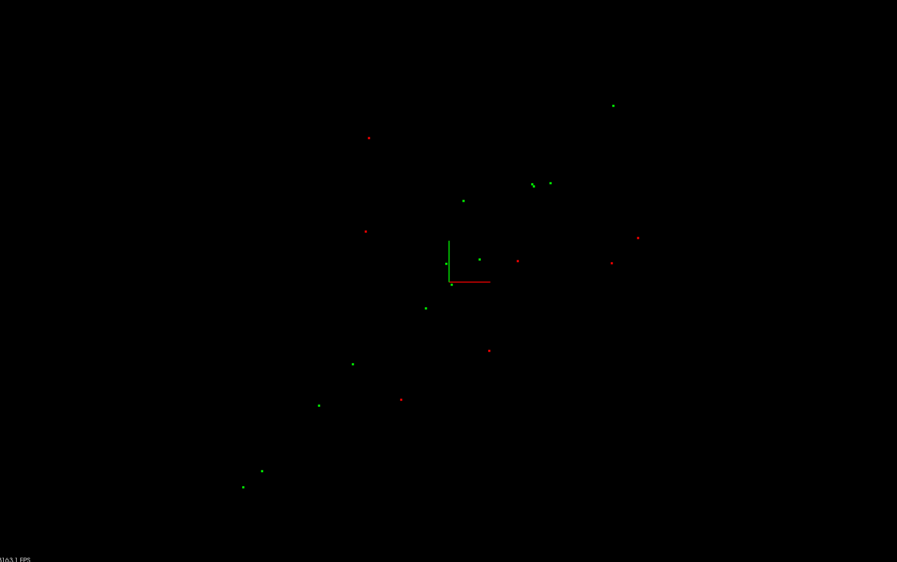
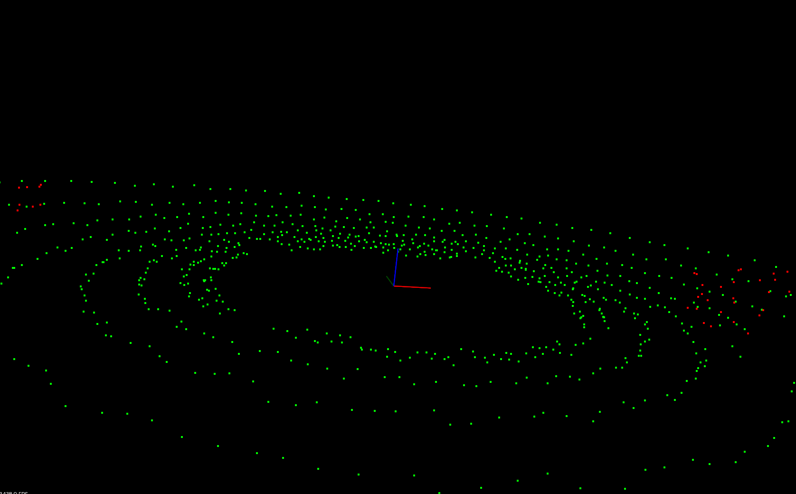

# PCL Practice

A repo in which I practice PCL library.

- Below is segmentation of road (green) and obstacles (red) using _RANSAC_ using _PCL_. 

	
	
- Below is a line fitted to given points using RANSAC, with `maxIterations = 50`, `distanceTolerance = 0.8`. `Green points` are the inliers for line and `Red points` are outliers.

	
- Below is a plane fitted to given set of points using RANSAC with `maxIterations = 50`, `distanceTolerance = 0.3`
	